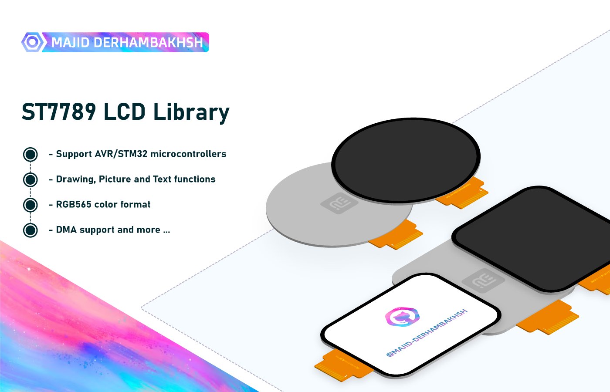

# ST7789 LCD Library
ST7789 LCD Library for ARM Cortex M (STM32) and AVR microcontrollers

## Release
### Version: 1.0.0

- #### Type: Embedded Software.

- #### Support :  
               - AVR series  
               - ARM STM32 series  

- #### Program Language: C

- #### Properties:
               - Drawing, Picture, and text functions  
               - RGB565 color format
               - DMA support 

                 and more features...

- #### Changelog:
               -   

## Overview 
### Initialization and de-initialization functions:
```c++
void ST7789_Init(void);
```  

### Operation functions:
```c++  
/* .......................... Control .......................... */
void ST7789_SetRotation(uint8_t Rotation);
void ST7789_SetWindowAddress(uint16_t XStart, uint16_t YStart, uint16_t XEnd, uint16_t YEnd);
void ST7789_InvertColors(ST7789_InvTypeDef Invert);
void ST7789_TearEffect(ST7789_ColorModeTypeDef Tear);

/* ...................... Color Converting ..................... */
ST7789_ColorTypeDef ST7789_Color_GetFromRGB(uint8_t R, uint8_t G, uint8_t B);
ST7789_ColorTypeDef ST7789_Color_GetFromHex(uint32_t HexCode);

/* ........................... Fill ............................ */
void ST7789_Fill(uint16_t XStart, uint16_t YStart, uint16_t XEnd, uint16_t YEnd, ST7789_ColorTypeDef Color);
void ST7789_FillScreen(ST7789_ColorTypeDef Color);

/* .......................... Drawing .......................... */
void ST7789_DrawPixel(uint16_t XPos, uint16_t YPos, ST7789_ColorTypeDef Color);
void ST7789_DrawPixel_4px(uint16_t XPos, uint16_t YPos, ST7789_ColorTypeDef Color);
void ST7789_DrawLine(uint16_t XStart, uint16_t YStart, uint16_t XEnd, uint16_t YEnd, ST7789_ColorTypeDef Color);
void ST7789_DrawRectangle(uint16_t XStart, uint16_t YStart, uint16_t XEnd, uint16_t YEnd, ST7789_ColorTypeDef Color);
void ST7789_DrawFilledRectangle(uint16_t XPos, uint16_t YPos, uint16_t Width, uint16_t Height, ST7789_ColorTypeDef Color);
void ST7789_DrawCircle(uint16_t XPos, uint16_t YPos, uint8_t Radius, ST7789_ColorTypeDef Color);
void ST7789_DrawFilledCircle(int16_t XPos, int16_t YPos, int16_t Radius, ST7789_ColorTypeDef Color);
void ST7789_DrawTriangle(uint16_t X1, uint16_t Y1, uint16_t X2, uint16_t Y2, uint16_t X3, uint16_t Y3, ST7789_ColorTypeDef Color);
void ST7789_DrawFilledTriangle(uint16_t X1, uint16_t Y1, uint16_t X2, uint16_t Y2, uint16_t X3, uint16_t Y3, ST7789_ColorTypeDef Color);

/* ........................... Image ........................... */
void ST7789_PutImage(uint16_t XPos, uint16_t YPos, uint16_t Width, uint16_t Height, const uint16_t *Image);

/* ........................... Text ............................ */
void ST7789_PutChar(uint16_t XPos, uint16_t YPos, char Ch, ST7789_FontTypeDef Font, ST7789_ColorTypeDef Color, ST7789_ColorTypeDef BackgroundColor);
void ST7789_PutString(uint16_t XPos, uint16_t YPos, const char *Str, ST7789_FontTypeDef Font, ST7789_ColorTypeDef Color, ST7789_ColorTypeDef BackgroundColor);

``` 
### Macros:
```c++  
- None 
``` 

## Guide

#### This library can be used as follows:
#### 1.  Add st7789.h header
#### 2.  Add required headers and set up SPI and GPIO in st7789_conf.h header:
  ```c++
#include "spi.h"

#define ST7789_SPI             hspi1

#define ST7789_RST_GPIO_PORT   GPIOA
#define ST7789_RST_GPIO_PIN    0

#define ST7789_CS_GPIO_PORT    GPIOA
#define ST7789_CS_GPIO_PIN     1

#define ST7789_DC_GPIO_PORT    GPIOA
#define ST7789_DC_GPIO_PIN     2

#define ST7789_SPI_TIMEOUT     1000
  ``` 
#### 3.  Set DMA in st7789_conf.h header, for example:
  ```c++
// Comment the line if don't use DMA
#define ST7789_USE_DMA

#define ST7789_DMA_MIN_SIZE  16 // Minimum size of data length
  ```
#### 4.  Set Buffer in st7789_conf.h header, for example:
  ```c++
/*

	The LCD Buffer length is determined as follows:
	
		LCD_BUFFER_LENGTH = ST7789_WIDTH * ST7789_HOR_LEN
	
	Notice:
		- DMA needs the LCD Buffer to transmit packets
		- If your MCU RAM size is very low, disable DMA
		
		- Increase LCD Buffer length to LCD resolution size for increased speed (If MCU has enough RAM)
	
*/

#define ST7789_HOR_LEN 	     5 // Buffer length factor
  ```
#### 5.  Set LCD width, Height, and rotation in st7789_conf.h header, for example:
  ```c++
#define ST7789_WIDTH     240
#define ST7789_HEIGHT    280
#define ST7789_ROTATION  2
  ``` 
      
## Examples  

## Test Performed:
- [x] STM32F1  
- [x] STM32G0  
- [ ] AVR  

### Developer: Majid Derhambakhsh
